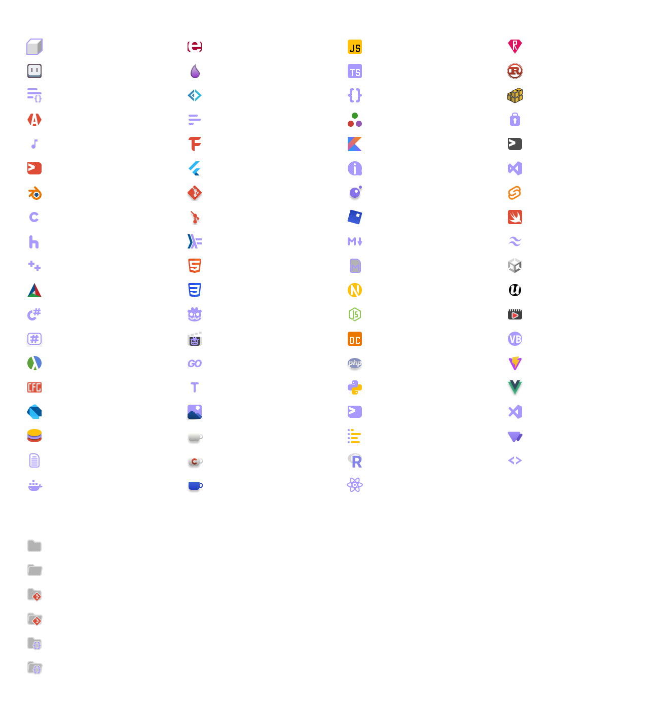

# CalmCode Icons

  

Minimal, clean, and expressive SVG icon theme for VS Code.

CalmCode Icons gives your Explorer a calmer, more polished look with a soft palette, sharp readability, and support for a large set of popular languages, frameworks, config files, media assets, and common project folders.

## License

MIT
