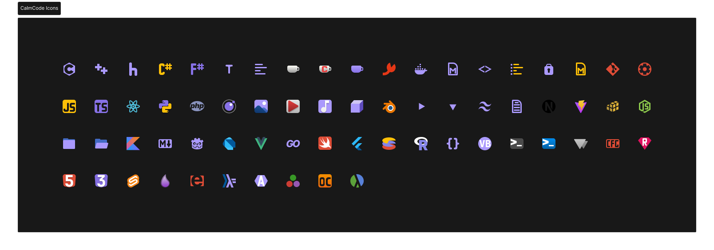

# 🎨 CalmCode Icons

A minimal, muted icon theme for **Zed Editor** — designed for long coding sessions with eye comfort in mind.



---

# ✨ Features

- 🎨 **Muted Color Palette** — Low saturation colors that are easy on the eyes
- 📦 **32×32 SVG Icons** — Optimized size for Zed's UI, crisp at any scale
- 🧘 **Minimalist Design** — No visual noise, just clear file identification
- 🌗 **One Theme, Any Mode** — Works seamlessly with both dark and light color themes
- 📁 **30+ File Types** — Support for popular languages and frameworks
- 🎯 **Universal Folders** — Clean, consistent folder icons for all directories

---

## 📦 Installation

### Via Zed Extensions (Recommended)

1. Open Zed
2. Press `Ctrl + Shift + P` (or `Cmd + Shift + P` on macOS)
3. Select **`Extensions: Install Extension`**
4. Search for **`CalmCode Icons`**
5. Click **Install**

### Manual Installation

1. Clone this repository:
   ```bash
   git clone https://github.com/NikNeza/calmcodeicons-zed.git
   ```
2. Move to Zed extensions folder:
   - **Windows:** `%APPDATA%\Zed\icon_themes\`
   - **Linux:** `~/.config/zed/icon_themes/`
   - **macOS:** `~/Library/Application Support/Zed/icon_themes/`
3. Restart Zed

---

## ⚙️ Usage

1. Open Zed Settings: `Ctrl + ,` (or `Cmd + ,` on macOS)
2. Add or modify the following:
   ```json
   {
     "icon_theme": "CalmCode Icons"
   }
   ```
3. Or use command palette: `Ctrl + Shift + P` → **`Icon Theme: Select Icon Theme`** → **`CalmCode Icons`**

---

# 🗂️ Supported File Types

| Category                 | Extensions                                                                                                       |
| ------------------------ | ---------------------------------------------------------------------------------------------------------------- |
| **Systems Languages**    | `.rs`, `.c`, `.h`, `.cpp`, `.cc`, `.cxx`, `.hpp`, `.hxx`, `.cs`, `.fs`, `.swift`, `.kt`, `.kts`, `.java`, `.jar` |
| **Web Languages**        | `.js`, `.jsx`, `.ts`, `.tsx`, `.html`, `.htm`, `.css`, `.scss`, `.sass`, `.less`, `.vue`, `.svelte`              |
| **Scripting Languages**  | `.py`, `.rb`, `.php`, `.sh`, `.bash`, `.zsh`, `.fish`, `.ps1`, `.bat`, `.cmd`, `.lua`, `.gd`, `.wgsl`, `.asm`    |
| **Functional Languages** | `.hs`, `.clj`, `.ex`, `.exs`, `.erl`, `.ml`, `.ocaml`, `.fs`, `.r`, `.R`, `.jl`                                  |
| **Config & Data**        | `.json`, `.toml`, `.yaml`, `.yml`, `.xml`, `.xaml`, `.env`, `.properties`, `.lock`                               |
| **Documentation**        | `.md`, `.markdown`, `.txt`, `LICENSE`, `README`                                                                  |
| **Media Files**          | `.svg`, `.png`, `.jpg`, `.jpeg`, `.gif`, `.webp`, `.ico`, `.mp4`, `.mp3`                                         |
| **3D & Graphics**        | `.fbx`, `.obj`, `.stl`, `.step`, `.stp`, `.gltf`, `.glb`, `.blend`                                               |
| **Database**             | `.sql`, `.db`, `.graphql`, `.gql`                                                                                |
| **Other**                | `.class`, `.godot`, `.dart`, `.flutter`, `.go`, `.vb`, `.jar`                                                    |

---

## 🎨 Color Theme Pairing

This icon theme is designed to work perfectly with **[CalmCode Color Theme](https://github.com/NikNeza/calmcode-zed)**.

For the best experience, use both together:

```json
{
  "theme": "CalmCode",
  "icon_theme": "CalmCode Icons"
}
```

---

## 🛠️ Development

### Building Locally

1. Clone the repository:

   ```bash
   git clone https://github.com/YOUR_USERNAME/calmcodeicons-zed.git
   cd calmcodeicons-zed
   ```

2. Install as dev extension in Zed:
   - `Ctrl + Shift + P` → **`zed: install dev extension`**
   - Select the project folder

3. Make changes to `icon_themes/calmcode_icons.json` or `icons/*.svg`

4. Reload Zed: `Ctrl + Shift + P` → **`Zed: Reload Window`**

### Icon Guidelines

- **Size:** 32×32 px viewBox
- **Format:** SVG with `currentColor` for stroke/fill
- **Style:** Minimal, 3-4px stroke width, rounded caps
- **Padding:** ~1-4px from frame edges

---

## 📄 License

This project is licensed under the **MIT License** — see the [LICENSE](./LICENSE) file for details.

---

## 🤝 Contributing

Contributions are welcome! Feel free to:

1. Fork the repository
2. Create a feature branch: `git checkout -b feature/new-icon`
3. Commit your changes: `git commit -m 'Add new icon'`
4. Push to the branch: `git push origin feature/new-icon`
5. Open a Pull Request

### Requesting New Icons

Open an issue with:

- File extension or filename
- Preferred icon style/reference
- Use case description

---

## 🙏 Acknowledgments

- Icons designed in **Figma** with love ❤️
- Built for the amazing [Zed Editor](https://zed.dev/)

---

## 📬 Contact

- **GitHub:** [@NikNeza](https://github.com/NikNeza)
- **Issues:** [Report a bug](https://github.com/NikNeza/calmcodeicons-zed/issues)
- **Discussions:** [Share your feedback](https://github.com/NikNeza/calmcodeicons-zed/discussions)

---

<p align="center">
  <strong>Enjoy CalmCode Icons! 🧘‍♂️</strong><br>
  Made with calm and precision for developers who value clarity.
</p>
